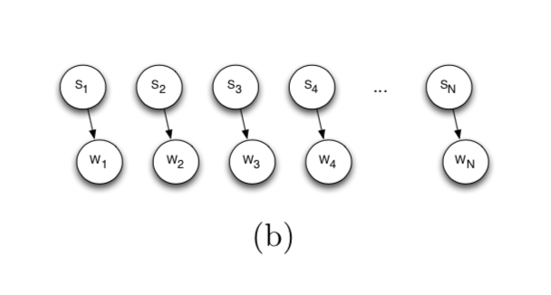
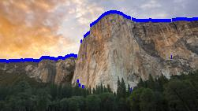
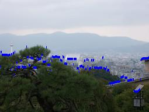
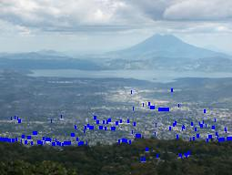
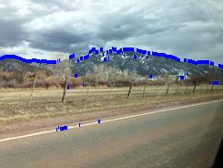
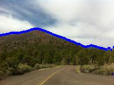
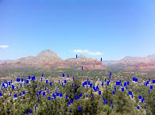
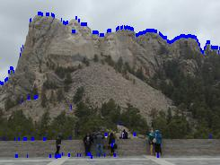
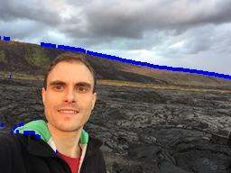
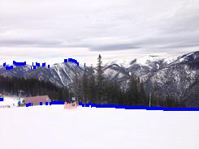

AI report :

<h2>Part - 1  </h2>
Citations : "inspred approach of minimax from vkprajap"
Method : 
</br>
Here I have implemented min max algorithm with alpha beta pruning for the game . 
Here to calculate the score I have implemented heuristic function which takes into account the monotonicity , smoothness , number of empty tiles, weighted tiles . 
</br>
Monotonicity :
</br>
We are calculating monotonicity such that from a particular point the value of tiles in the right side of it should be more or equal to the current value’s tile . i.e. if the current tile is B : then the tiles less the B in lexicographical order will be on its left and tiles greater than it by value should be greater than B. If this case is violated then we assign a penalty for that . The same case is for upper and lower side. I.e the upper values should be increasing whereas the lower values should be decreasing by value 
</br>
Smoothness : 
</br>
The tiles with same value should be nearer to each other so that they can be merged easily .

Empty tiles : 
</br>
This function plays a major role in calculating the final score as the game might go into deadlock and so to avoid that we give bonus if more empty tiles are there . 
</br>
Weighted tiles : 
</br>
The tiles are given weights according to their position. 

Min - Max :
</br>
Here, we implemented min - max tree with alpha beta pruning . 

Initial state : 
</br>
Depends on the whether the method is deterministic or non-deterministic .


Goal Node : 
</br>
K state should be reached 

Successor :
</br>
Successors till specified depth are calculated . Each node will have 4 successors (R ,U L , D). 

Actions. : 
</br>
Here we can choose ( either of the four actions : R , L , U , D ).

Problems faced :
</br>
With trial and error we tried and tested many combinations to set the scaling factor for all heuristics . According to that we found that smoothening plays the majority role , whereas monotonicity and empty tiles are ranked equally.


<h2>Part 2 : Horizon finding</h2>
<h3>Aim: </h3>To extract the horizon of the mountain images using Naive Bayes, Viterbi Algorithm and Viterbi aided with human input.
<h3>part 1:</h3>

Among the 3 parts that were needed to be finished, the first part seemed the easiest to implement. Although it was easy to implement and gave good results for a few images, it worked not quite well for other images.

Thought process and approach:
</br>
For every column, we found the the row with the highest gradient and connected the path.
At first this might look like a very good idea since intuitively we feel that highest gradient only exists at the ridge line but this is not the case the case. When trees or others come into the picture(pun intended), sometimes their gradient is higher than the gradient of the ridge line. This will lead to erroneous results in some cases where the gradient of these other objects are pretty high. 

</br>
Results: Te results of the first part shows that what we have asserted above is true.




The trees gradient is more than the dark mountains so here our method wont work.




Here, the trees and that white road marking have higher gradient(due ti higher contrast with th background color)


This one came out really nice since the gradients were clearly greater at the ridge line.









This is one of the most difficult pictures to work with. The white color ice has extremely high contrast compared to the mountain so our bayes nets wont work.

From our previous results we see that, some pictures showed really bad ridge lines. This calls for a better method to improve our results.


<h2>Part 2:</h2>
To improve upon this we have to use Viterbi algorithm.
<image src="viterbi.jpg">

Here we use the hidden states transition probability i.e the the columnn and the emission probabilites are normalized gradient values in that particular column. 
We know that there are no sudden and extreme dips or highs in a mountain. The expand or move out gradually. So, we can use these assumptions to design a heuristic and adjust our transition probabilities so that we draw the ridge line in the right direction.

Thought process and approach: 
The main problem was to establish the transition probabilities. We were trying to figure out a way to assign transition probabilities to the rows of the adjacent column and using viterbi algorithm 

Approach 1 : Using of a vertical gaussian where the peak is assigned to the adjacent row and the two tails depict the probabilities if the rows in th up and down direction of that column. This did not work out very well as it wasnot assigning low probabilities to the far elements and calculating the standard deviation of the gaussian was very difficult.


<h2>Approach 2: Using distance metric to assign probabilities.</h2>
</br>
Then our next approach was to use the number of rows the next highest gradient probability is from the row of the previous column. Based on our assumption the next highest gradient should not be very far from our previous observation. So, we assigned the probabilites for each row of the next column as inverse of the distance of rows. If the distance is too high the probability will be very low for that cell. 
</br>
Now, it was putting all the probabilities together. We had to multiplt the transition probability, emission probability and the probability from the previous state. 
The main challenge was in assigning "right" transition probability and emission probability to get the ebst result. This took a lot of time. We took the log of these probabilities to tackle the underflow error (probabilities can get really small!!) and we were tweaking the values the values to get a right fit. 
We needed to find the right "TRADEOFF" between the weights of emission probabilites and transition probabilities for this algorithm to work. The right tradeoff was achieved to some extent but did not work for all the images because the gradients were just too low at the mountain ridge line.
</br>
The results for this were better than just implementing Naive Bayes.
Results:

<image src="output_map_1.jpg">
<image src="output_map_2_left.jpg">
<image src="output_map_3.jpg">
 In some images such as this one and the previous onethe initial point is very hard to get. But once we overcome this issue, we can expect a clear distinct ridge line.
<image src="output_map_4_left.jpg">
 There were too many high gradient cells within th elow distance range to assign them low probability values.
<image src="output_map_5_left.jpg">
<image src="output_map_6_left.jpg">
  No right tradeoff was found for the viterbi to work for this image.
<image src="output_map_7_left.jpg">
<image src="output_map_8_left.jpg">
<image src="output_map_9_left.jpg">


<h2>Part 3: Human feedback with viterbi.</h2>
<br/>
The problem with the images was that the starting point was being incorrectly selected. So, we tried to start from 20 points in the start. We put the gradients in descending order and picked the top 20 and started the viterbi algorithm form the 20 points. This will be shown in code implementation which is being attache here.

Thought process and approach:
</br>
Viterbi with human interaction:


-> We start from 20 different points with the highest probabilities in the first column.


->Hence we develop 20 different paths using the viterbi algorithm itself.


->Then we find the distance of the point given as input by the human to the computer and see which of the 20 lines the point is closest to.


This is done by taking the sum of the manhattan distance of that point to every point in a line.


The line which is shortest distance to that point is finally chosen as the ridgeline and drawn on the image.

The results were quite good compared to the previous two methods.
Results:
</br>
<image src="output.jpg">
  </br>
<image src="output_2_left.jpg">
  </br>
<image src="output_3.jpg">
  </br>
<image src="output_4_left.jpg">
</br>
<image src="output_5_left.jpg">
</br>
<image src="output_6_left.jpg">
</br>
<image src="output_7_left.jpg">
</br>
<image src="output_8_left.jpg">
</br>
<image src="output_9_left.jpg">


We can see thta the results are better than other approaches.

<h2>Conclusion:</h2>
<br/>
Here we have used 3 methods to draw a ridge line across the mountains. The naive bayes worked well for very few images but was incompetent, then to improve upon this we used Viterbi algorithm. Although it gave us some success, it too had some flaws and finally the human feedback gave us the best output. Some images which ar blurry( so blurry that even we cant find the mountain ridge with our naked eyes) that it will very hard for these algorithms to detect the ridges. We must come up with a new approach involcing image processing techniques to find the ridge lines accurately and efficiently.
For example shadowing out the trees by filtering the green color so that their gradient will automatically reduce. This may again cause some issues as some mountains maybe green in colour which will get affected badly. But again this is all about tradeoffs. To gain something you must lose something. And acheiving 100% accuracy will always be difficult for people working in the field of AI.


```python

```
